# 子メロン検出モデルの構築手順

## 1. 目的

本資料では、摘果作業動画から子メロン検出モデルを構築するまでの手順と、学習後の評価結果をまとめる。対象クラスは `young_melon` の1クラスであり、YOLO形式の教師データを作成して Ultralytics YOLO をファインチューニングした。

対象は、摘果前の作業動画に映る子メロンである。動画には子メロンが映っていない区間も含まれるため、まず不要な区間を動画編集ソフトで取り除き、その後に画像切り出し、アノテーション、学習、評価を行った。
具体的なコードや再現手順は、[YOLOファインチューニングテンプレート](yolo_finetune_template/README) にまとめている。

## 2. 全体の流れ

本プロジェクトでは、以下の順序で検出モデルを構築した。

1. 摘果作業動画を確認する。
2. 子メロンが映っていない区間を動画編集ソフトで切り取る。
3. 編集後の動画から1秒間隔で画像を切り出す。
4. 切り出した画像に対して子メロンを矩形でアノテーションする。
5. YOLO形式の教師データを作成する。
6. YOLOモデルをファインチューニングする。
7. testデータと推論動画で検出結果を確認する。

## 3. 動画編集と画像切り出し

摘果作業動画のうち、子メロンが映っていない区間を動画編集ソフトで取り除いた。
その後、編集後の動画から1秒に1枚の間隔で画像を切り出した。ファイル名は `video01_000001.jpg` のように動画名と連番で管理した。

切り出した画像は合計 784枚 である。

| 動画 | 切り出し画像数 |
| --- | ---: |
| video01 | 139 |
| video02 | 91 |
| video03 | 102 |
| video04 | 74 |
| video05 | 51 |
| video06 | 59 |
| video07 | 113 |
| video08 | 42 |
| video09 | 51 |
| video10 | 38 |
| video11 | 24 |
| 合計 | 784 |

## 4. アノテーションとYOLO形式教師データ

切り出した画像に対して、子メロンの位置を矩形でアノテーションした。アノテーション結果はYOLO形式のテキストファイルとして保存した。
アノテーション作業は、[Label Studio 環境構築まとめ](../label-studio_setup/label-studio_setup) の手順に従って実施した。

YOLO形式では、1つの物体を次の形式で1行に記録する。

```text
class_id x_center y_center width height
```

今回のクラスは `young_melon` のみであり、`class_id` は `0` に統一した。座標値は画像幅・画像高さで正規化された0から1の値である。

以下は、同じ画像について「元画像」「アノテーション済み画像」「YOLO学習後の検出結果」を並べた例である。

### 例1: `video04_000022`

| 元画像 | アノテーション済み画像 | YOLO検出結果 |
| --- | --- | --- |
| 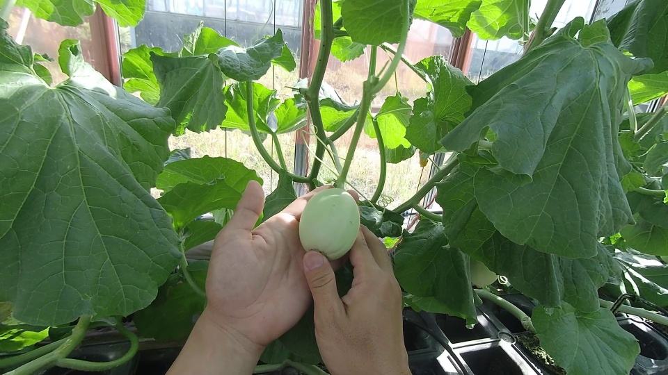 | 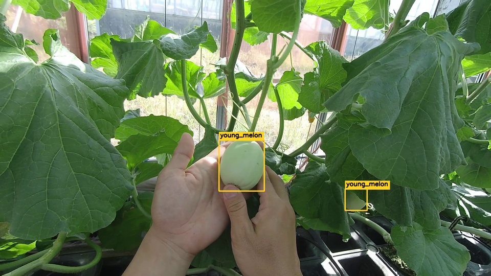 | 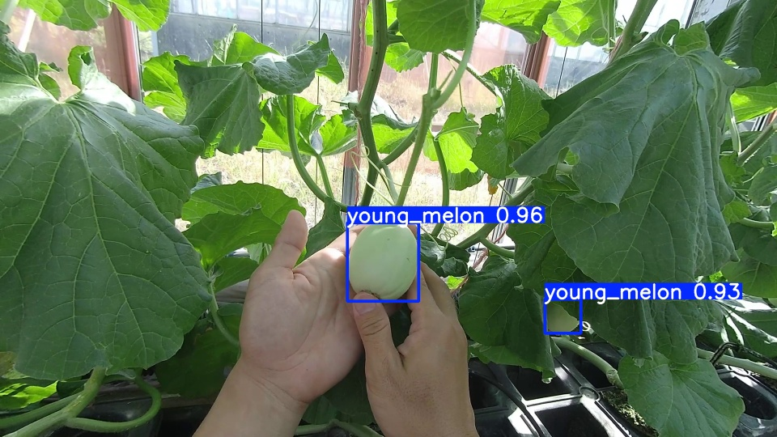 |

### 例2: `video07_000046`

| 元画像 | アノテーション済み画像 | YOLO検出結果 |
| --- | --- | --- |
| 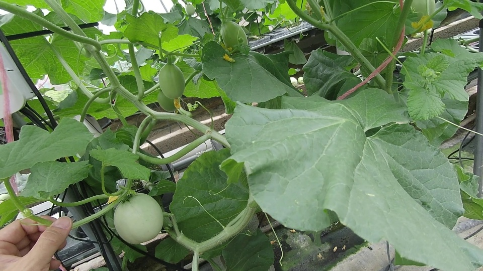 | 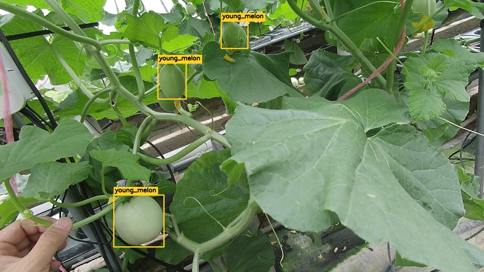 | 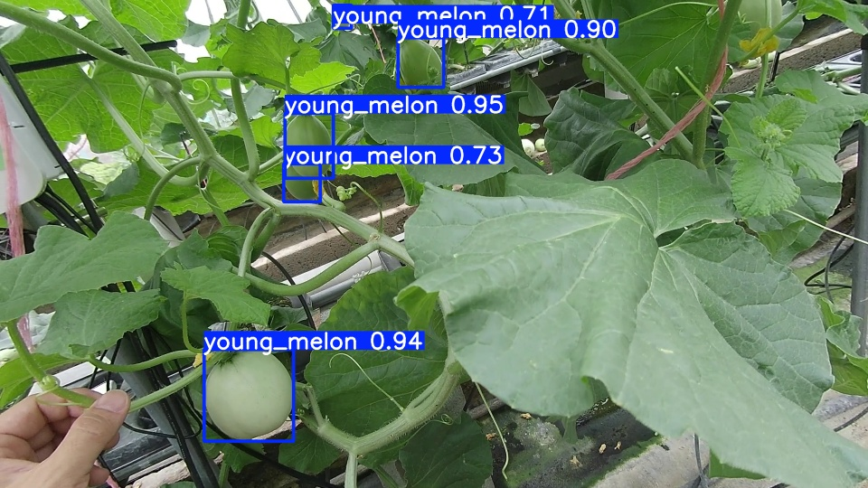 |

### 例3: `video09_000038`

| 元画像 | アノテーション済み画像 | YOLO検出結果 |
| --- | --- | --- |
| 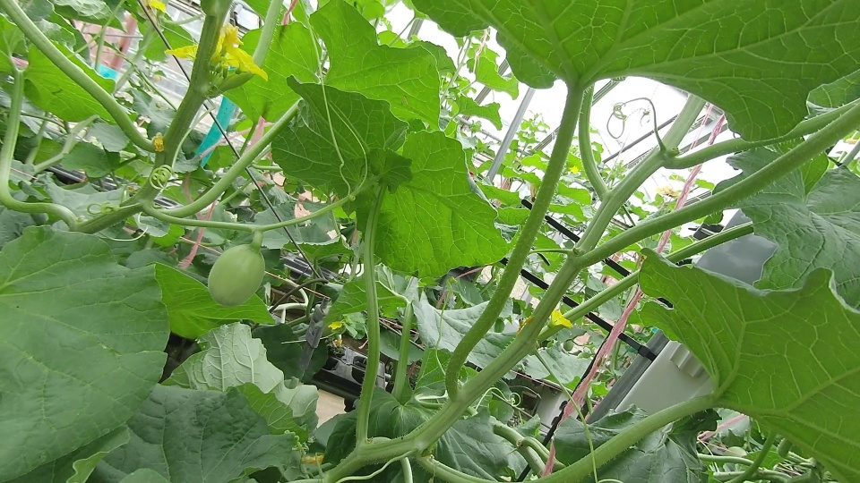 | 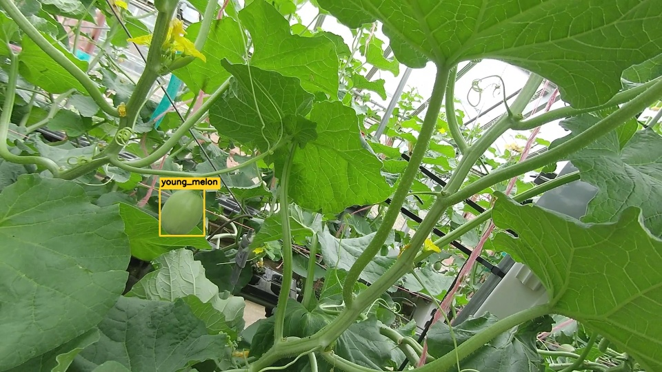 | 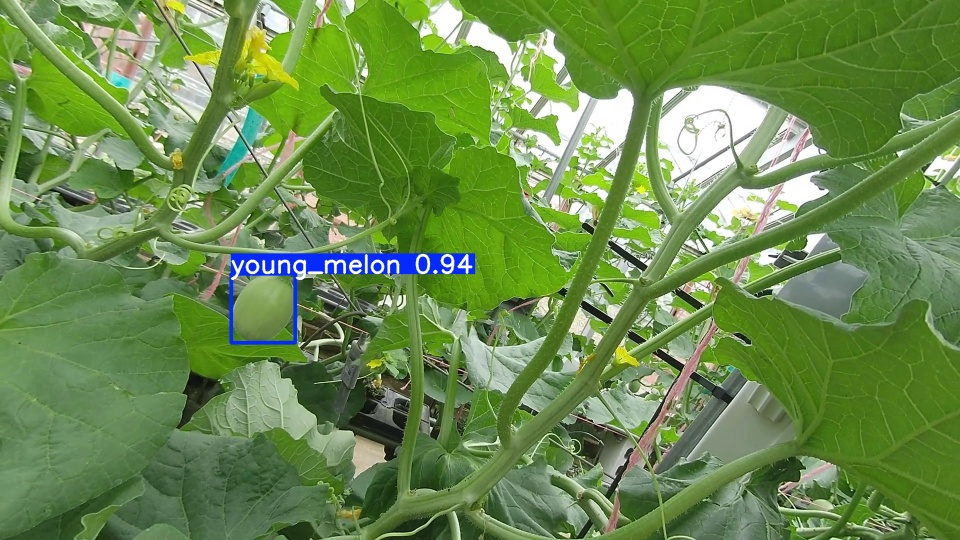 |

## 5. 学習データの作成

作成したYOLO形式データを使って、2種類の学習条件を比較した。

1つ目は、アノテーション済み画像から100枚をランダムに抽出し、画像単位でtrain/val/testに分割した条件である。少量データでパイプライン全体が動くことを確認する目的で使用した。

2つ目は、利用可能な最大データを使い、動画単位でtrain/val/testが混ざらないように分割した条件である。こちらは、未知の動画に対する汎化性能を確認する目的で使用した。

| 項目 | ランダム100枚 | 動画ごと分割最大データ |
| --- | ---: | ---: |
| train画像数 | 70 | 275 |
| val画像数 | 15 | 24 |
| test画像数 | 15 | 89 |
| 合計 | 100 | 388 |
| 学習epoch | 100 | 200 |
| 分割方法 | 画像単位ランダム | 動画単位 |

動画ごと分割最大データでは、`video01` をtest動画として分離し、学習時に同じ動画の画像がtrainやvalへ混ざらないようにした。

## 6. ファインチューニング

学習にはUltralytics YOLOを使用した。事前学習済みの軽量YOLOモデルを初期値として、作成した `young_melon` 1クラスの教師データでファインチューニングした。

ランダム100枚条件では100epoch、動画ごと分割最大データ条件では200epochで学習した。評価では、学習中のval結果だけでなく、test splitに対する評価結果を確認した。

### ランダム100枚条件の学習曲線

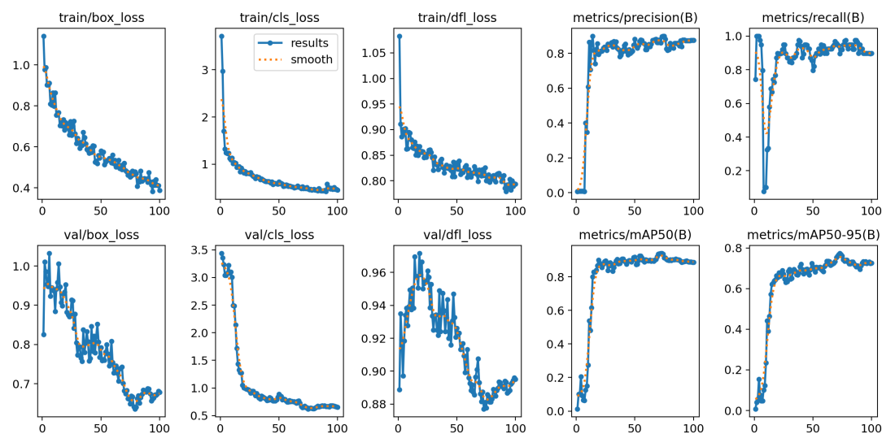

### 動画ごと分割最大データ条件の学習曲線

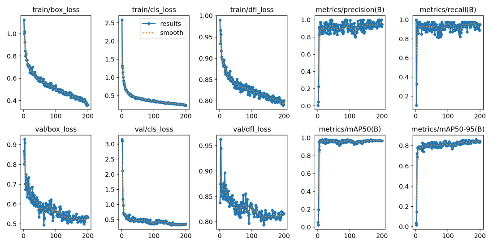

## 7. 評価結果

評価指標は、testデータに対して算出した。ここではPrecision、Recall、mAP50、mAP50-95を比較する。

| 指標 | ランダム100枚 | 動画ごと分割最大データ |
| --- | ---: | ---: |
| Precision | 0.963 | 0.951 |
| Recall | 0.867 | 0.902 |
| mAP50 | 0.862 | 0.902 |
| mAP50-95 | 0.817 | 0.827 |


## 8. 推論動画の確認

学習後のモデルを用いて、動画に対する推論も行った。推論結果では、動画中の子メロンに対して検出枠が描画される。

| ランダム100枚モデル | 動画ごと分割最大データモデル |
| --- | --- |
| 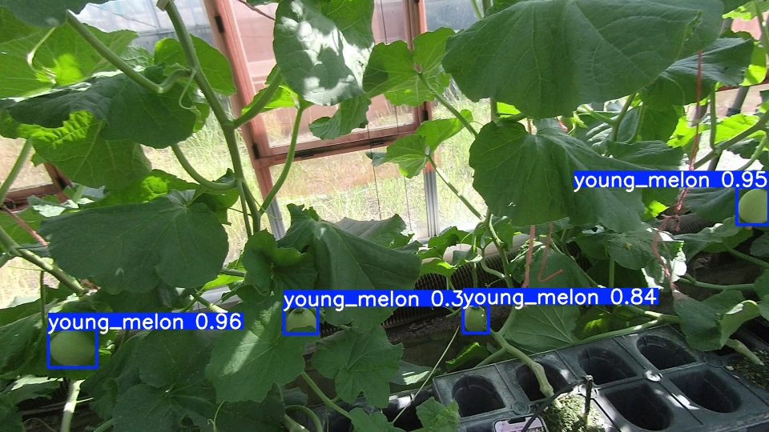 | 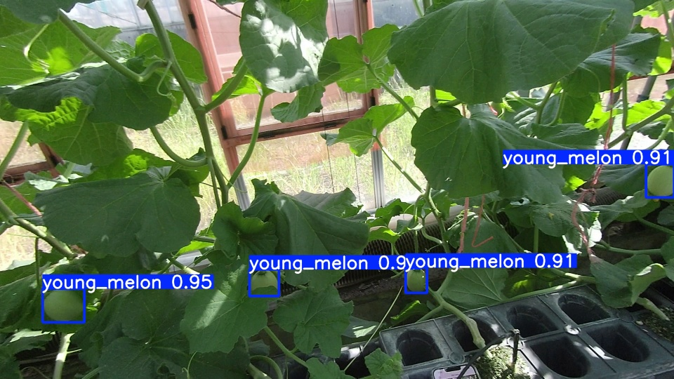 |

## 9. 結果の考察

ランダム100枚条件でも、test mAP50は **0.862** となり、少量データでも子メロン検出モデルを構築できることが確認できた。一方で、画像単位のランダム分割では、同じ動画内の近いフレームがtrain、val、testに分かれて入る可能性がある。そのため、実際の未知動画に対する性能よりも高く見える可能性がある。

動画ごと分割最大データ条件では、test mAP50が **0.902**、test Recallが **0.902** となった。test動画を学習に使わない条件で評価しているため、ランダム分割よりも実運用に近い評価条件である。

今回の結果から、子メロン検出モデルの構築手順として、動画編集、画像切り出し、アノテーション、YOLO形式データ作成、ファインチューニング、test評価、動画推論までの一連の流れを確認できた。今後は、さらに別の動画をtestに回した比較や、アノテーション枚数の追加によって、より安定した汎化性能を確認することが重要である。

## 10. まとめ

本資料では、摘果作業動画から子メロン検出モデルを構築する手順をまとめた。動画編集によって不要区間を取り除き、1秒間隔で画像を切り出し、子メロンをアノテーションしてYOLO形式教師データを作成した。その教師データを用いてYOLOモデルをファインチューニングし、testデータと推論動画で検出結果を確認した。

ランダム100枚条件と動画ごと分割最大データ条件の両方を比較した結果、動画ごとに分割した評価の方が、未知動画に対する性能確認として適していると考えられる。

具体的なコードや再現手順は、次のページにまとめている。

- [YOLOファインチューニングテンプレート](yolo_finetune_template/README)


## 謝辞
実験データをご提供いただいた株式会社大和コンピューター様に感謝申し上げます。
