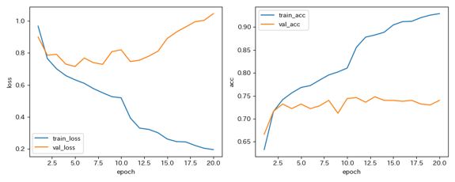
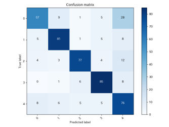

# キャッサバの葉の病害分類(アプローチ例)

## 概要

本ページでは，[キャッサバの葉画像を用いた病害分類タスク](cassava_overview)に対して，分類精度を向上させるために試したアプローチをまとめる．本タスクでは主に以下の観点からモデル改善を行った．

- データクレンジング
- ハイパーパラメータ調整
- データ拡張
- データ不均衡性の解消
- モデル変更

---

## 1. データクレンジング
本タスクを行うにあたって，初めにデータの品質を確認しておくことが重要である．
キャッサバ画像分類では，学習データの中に以下のような画像が含まれていた．

- 葉がほとんど写っていない・極端に小さい画像
- キャッサバの葉ではなく，芋・茎・枝・人などが大きく写っている画像
- 枯れた葉や背景が中心の画像

このような画像は，モデルが病害の特徴ではなく背景や不要な物体を学習してしまう原因となる．そのため，まずはデータの品質を高めることが重要だと考えた．

### 1.1 緑領域の割合によるノイズデータ除去

分類の対象がキャッサバの葉であるため，画像内には一定量の緑色領域が含まれると考えられる．そこで，画像をHSV色空間に変換し，緑画素を以下のように定義し，その割合を計算した．


```python
H: 35 ~ 85
S: 40 ~ 255
V: 20 ~ 255
```

各画像について緑画素の割合を求め，割合が一定の閾値以下の画像を「ノイズデータ候補」として分離した．

検証では，緑領域の閾値を0.05，0.10，0.15，0.20，0.25，0.30のように変化させ，閾値以下の画像を除去したデータセットで精度を比較した．

### 1.2 手作業によるノイズデータ除去

1.1で緑領域の閾値を高くしすぎると，本来使える画像まで除去してしまう可能性がある．そのため，緑領域の割合だけで完全に判断するのではなく，除去候補を目視で確認することが必要だと考えた．そこで，候補画像を目視で確認し，学習に使えそうな画像を手動でデータセットに戻す作業を行った．

---

## 2. ハイパーパラメータ調整

ハイパーパラメータは，モデルの学習の進み方や精度に大きく影響する．

### 2.1 変更したハイパーパラメータ

本タスクでは，主に以下のハイパーパラメータを調整し，学習の安定性や過学習の様子を確認した．

- 入力画像サイズ：224 → 256

  入力画像サイズを大きくすることで，葉の模様や病害の細かな特徴をより多く保持できるようにした．ただし，画像サイズを大きくするとGPUメモリ使用量や学習時間も増加するため，計算環境とのバランスを考える必要がある．

- バッチサイズ：4 または 8

  学習の安定性とGPUメモリ使用量のバランスを見ながら調整した．バッチサイズが小さい場合はメモリ消費を抑えられる一方で，勾配の更新が不安定になる可能性がある．

- エポック数：10 → 30
  
  学習を十分に進めるために増やした．ただし，学習を長く続けると過学習が発生する可能性があるため，学習曲線を確認しながら調整することが重要である．

- Dropout率：0.3 → 0.2
  
  過学習を抑えるために調整した．Dropout率が高すぎると学習が進みにくくなり，低すぎると過学習を抑えにくくなるため，モデルの規模やデータ数に応じて設定する必要がある．

---

## 3. データ拡張

画像分類では，学習データが少ない場合やデータに偏りがある場合，データ拡張によってモデルの汎化性能を高めることができる．

本タスクでは，キャッサバの葉の向き，明るさ，拡大率などが画像ごとに異なるため，これらの変化に対応できるようにデータ拡張を行った．

### 3.1 試したデータ拡張

主に以下のデータ拡張を試した．

- 拡大：1.0〜1.66倍
- 回転：±20°
- 左右反転
- 上下反転
- 明るさ変更：0.8〜1.2倍
- コントラスト変更：0.8〜1.2倍
- RandomResizedCrop：scale=(0.7, 1.0)
- RandomErasing：p=0.25
  
  画像の一部を隠すことで，葉の一部分だけに依存しすぎないようにする目的で使用した．ただし，病害の特徴部分を隠してしまう可能性もあるため，適用確率を高くしすぎないように注意する必要がある．

- CutMix：50%
- MixUp：50%
  
  CutMixやMixUpは，複数画像を組み合わせて学習する手法である．少数クラスの学習を強化したり，過学習を抑えたりする効果が期待できる．ただし，混合ラベルを扱うため，SoftTargetCrossEntropyなどの損失関数と組み合わせる必要がある．

---

## 4. データ不均衡性の解消

本データセットでは，クラスごとの画像枚数に大きな偏りがあった．特に，モザイク病の画像が多く，少数クラスの学習が進みにくいという問題があった．

データが不均衡なまま学習すると，モデルは多数クラスを予測しやすくなり，少数クラスの分類精度が低下してしまう．

そのため，以下の方法を試した．

- アップサンプリング

  本タスクでは，少数クラスを以下のように増やす条件を試した．

  - 最多クラスの半数まで増やす
  - 最多クラスと同数まで増やす

  ただし，単純に同じ画像を増やすだけではデータの多様性が増えない．そのため，データ拡張と組み合わせることが重要である．
- ダウンサンプリング
  
  本タスクでは，多数クラスを以下のように減らす条件を試した．

  - 最小クラスと同数まで削減
  - 最多クラスを2000枚(他クラスと同程度の枚数)に削減
  - 最多クラスを半分に削減

- ハイブリッドサンプリング

  ハイブリッドサンプリングは，アップサンプリングとダウンサンプリングを組み合わせた手法である．

  本タスクでは，以下の条件を試した．

  - 全クラス2000枚に統一
  - 最多クラスの半数に統一

- Class Weight

  損失関数にクラスごとの重みを設定する方法であり，少数クラスの損失を大きくすることでモデルが少数クラスを無視しにくくなる．

  重みは，例えば以下のように設定できる．

  ```python
  weight_i = 全サンプル数 / (クラス数 × クラスiのサンプル数)
  ```
- WeightedRandomSampler

  WeightedRandomSamplerは，少数クラスの画像がミニバッチに含まれやすくなるように，サンプリング確率を調整する方法である．
  
  これにより，学習中に少数クラスを見る回数を増やすことができる．
- Focal Loss
  
  Focal Lossは，簡単に分類できるサンプルの損失を小さくし，分類が難しいサンプルに注目して学習する損失関数である．

  不均衡データでは，多数クラスの簡単なサンプルが学習を支配してしまうことがある．Focal Lossを使うことで，少数クラスや分類困難なサンプルへの学習を強められる可能性がある．

---

## 5. モデル変更

### 5.1 比較したモデル

本タスクでは，以下のモデルを比較した．

- SimpleCNN
- EfficientNet-B0
- ResNet-50

### 5.2 SimpleCNN

SimpleCNNは，サンプルコードをもとにした基本的なCNNモデルである．

構成例は以下の通りである．

- 畳み込み層：4層
- プーリング層：4層
- 全結合層：2層
- 活性化関数：ReLU

SimpleCNNは構造が分かりやすく，ベースラインとして扱いやすい．一方で，複雑な画像分類タスクでは表現力が不足する可能性がある．

### 5.3 EfficientNet-B0

EfficientNet-B0は，軽量かつ高性能な画像分類モデルである．

特徴として，モデルサイズと精度のバランスが良く，事前学習済みモデルを利用することで比較的高い精度を得やすい．

### 5.4 ResNet-50

ResNet-50は，残差接続を用いた深いCNNモデルである．

スキップ接続により，深いネットワークでも勾配消失が起こりにくいという特徴がある．

---
## 6. 最終的に採用した構成と結果

複数のモデルとサンプリング手法を比較したうえで，以下の構成を最終的なモデルとして採用した．

### 6.1 採用した項目

- データクレンジング
  - 緑領域の割合が10%未満の画像を除去
  - 除外候補画像を確認し，学習に使用できそうな画像をデータセットに復元

- データ拡張
  - 拡大：1.0〜1.66倍
  - 回転：±20°
  - 左右反転
  - コントラスト変更：0.8〜1.2倍

- ハイパーパラメータ
  - バッチサイズ：4
  - 学習率：0.001
  - 入力画像サイズ：256
  - エポック数：20

- データ不均衡性の解消
  - 最多クラスを2000枚にダウンサンプリング

- モデル
  - EfficientNet-B0

### 6.2 最終結果

最終的には，EfficientNet-B0と，最多クラスを2000枚にダウンサンプリングしたデータセットを組み合わせたモデルを採用した．
最終的な精度と学習曲線，混同行列は以下の通りである．

```text
Accuracy: 0.7520
```



今回の検証では，SimpleCNNやResNet-50と比較して，EfficientNet-B0を用いた構成で最も高い精度が得られた．

一方で，学習曲線や混同行列を確認すると，過学習は完全には解消できていなかった．そのため，さらなる精度向上には，データ拡張の見直しや，交差検証，アンサンブル学習などが必要であると考えられる．

---

## 7. 追加で試してみたかったこと

### 7.1 ネットワーク構成の検討

今回は主に既存モデルを使用したが，さらに精度を向上させるためには，ネットワーク構成の詳細な検討も行いたかった．具体的には，以下のような点を試すことが考えられる．

- EfficientNetの別バージョンの比較
- ResNetの層数の違いによる比較
- Vision Transformer系モデルの導入
- Dropout層の位置や割合の変更
- 全結合層の構成変更
- Batch Normalizationの有無の比較

特に，EfficientNet-B0で良い結果が得られたため，EfficientNet-B1やEfficientNet-B2など，より大きなモデルも比較してみる価値がある．

### 7.2 アンサンブル学習

アンサンブル学習は，複数のモデルの予測を組み合わせる手法である．単一モデルでは誤分類してしまう画像でも，複数モデルの予測を組み合わせることで，より安定した分類ができる可能性がある．例として，以下のような組み合わせが考えられる．

- EfficientNet-B0 + ResNet-50
- EfficientNet-B0 + SimpleCNN
- 異なるデータ拡張で学習したEfficientNet-B0同士
- 異なるサンプリング条件で学習したモデル同士

予測の統合方法としては，以下が考えられる．

- 多数決
- 確率平均
- 重み付き平均

ただし，アンサンブル学習は複数モデルを学習・推論する必要があるため，計算コストが増加する点に注意が必要である．

### 7.3 交差検証

今回の検証では，データの分割によって結果が変わる可能性がある．

そこで，より信頼性の高い評価を行うために，交差検証を試してみたかった．

交差検証では，データセットを複数に分割し，学習データと検証データを入れ替えながら複数回評価する．

例：

```text
5-fold cross validation
```

交差検証を行うことで，特定の分割に依存しない平均的な性能を確認できる．

特に，データ数が少ないクラスがある場合や，データに偏りがある場合には有効である．

### 7.4 誤ラベル検出

画像分類では，ラベルが間違っているデータが含まれている場合がある．誤ラベルへの対処法として，以下の方法を検討した．

- CleanLab
- UMAPによる特徴量可視化
- Co-teaching
- Co-teaching+

CleanLabは，モデルの予測確率をもとに誤ラベル候補を検出する方法である．ただし，検出に使うモデルの性能が不安定な場合，誤ラベル候補の精度も低くなる．

UMAPは，特徴量空間上で分布から外れたサンプルを確認できるため，誤ラベル候補や外れ値候補の発見に使える可能性がある．

---

## 8. まとめ

本タスクでは，キャッサバの病害分類精度を向上させるために，データクレンジング，ハイパーパラメータ調整，データ拡張，データ不均衡性の解消，モデル変更を行った．

特に効果が大きかったのは，データクレンジングとモデル変更である．緑領域の割合を用いた自動的なノイズデータ候補の抽出に加えて，手作業で不適切な画像を除去することで，データセットの品質を向上させることができた．また，モデルをSimpleCNNからEfficientNet-B0に変更することで，分類精度が大きく向上した．さらに，データ不均衡性に対しては，最多クラスを適度にダウンサンプリングする方法が有効であった．最終的には，EfficientNet-B0と，最多クラスを2000枚にダウンサンプリングしたデータセットを組み合わせたモデルを採用し，Accuracy 0.7520を得ることができた．

一方で，過学習やクラス間の誤分類は完全には解消できなかった．そのため，今後はデータ拡張のさらなる改善，ネットワーク構成の検討，アンサンブル学習，交差検証，誤ラベル検出などを行うことで，より安定した分類モデルを構築できると考えられる．
