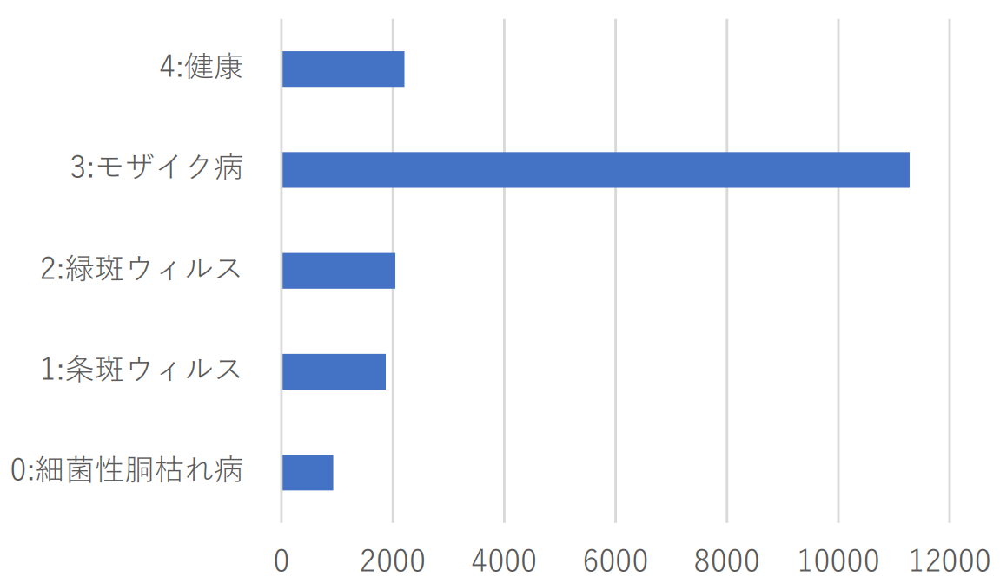
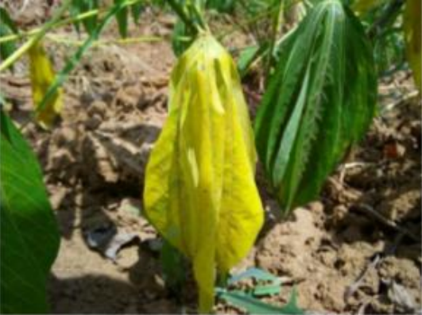
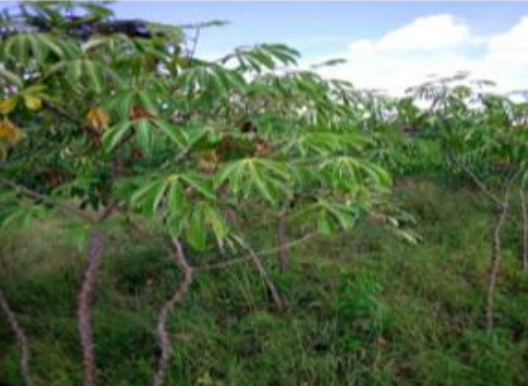
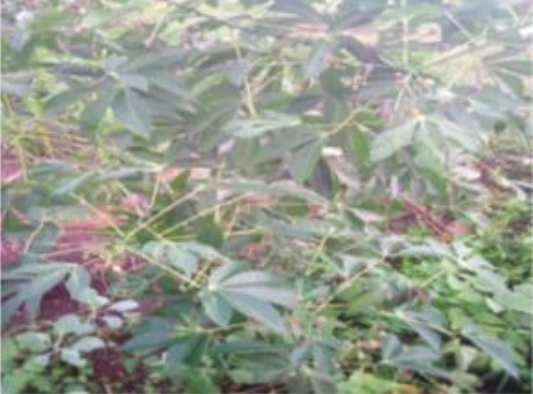

# キャッサバの葉の病害分類(実践編)

この課題では，キャッサバの病害の種類や健康状態を画像分類によって判別します．  

題材としているのは，2021 年に開催された Kaggle の画像分類コンペティション  [**Cassava Leaf Disease Classification**](https://www.kaggle.com/competitions/cassava-leaf-disease-classification/overview)
です．  
このコンペでは，キャッサバの葉画像から病害の種類を分類するモデルを構築し，分類精度を競います．  
画像分類におけるデータ前処理，データ拡張，モデル設計，学習結果の分析といった一連の流れを実践的に学ぶ題材として適しています．

## 分類対象
本課題では，以下の5クラスを分類対象とします．

1. 健康(healthy)

    

2. モザイク病(mosaic_disease)

    

3. 緑斑ウイルス(green_mottle)

    

4. 条斑ウイルス(brown_streak_disease)

    

5. 細菌性胴枯れ病(bacterial_blight)

    

## データセット
データセットは **Cassava Leaf Disease Classification** の画像分類コンペのものを使用します．  

峰野研究室の学生は，演習時に配布するデータセットを使用してください．  
それ以外の方は，以下の Kaggle 公式ページから各自でダウンロードしてください．

- [Cassava Leaf Disease Classification（Kaggle Dataset）](https://www.kaggle.com/datasets/nirmalsankalana/cassava-leaf-disease-classification)

ダウンロードしたデータセットは cassava_sample ディレクトリの直下に配置してください．
```
project_root/
├── intro.md               
├── requirements.txt       
├── summary.md             
├── data/                  
├── notebooks/              
├── cassava_sample/         
│   ├── ★dataset/ 　　# データセットはここに置く
│   ├── dataset.py    
│   ├── main.py
│   ├── model.py
│   ├── train_eval.py
│   ├── utils.py
│   └── visualize.py
└── util.py     
```
## データセットの特徴
このデータセットには，以下のような特徴があります．

- クラスごとに画像枚数の偏りがある

  

- ノイズを含む画像が多数存在する
  - 対象が画像の中心にない
  
    
  
  - 葉が枯れている
    
    
  
  - 画角が遠い
    
    
  
  - コントラストが高い
    
    

このような性質があるため，モデルの精度向上には，前処理やデータ拡張，モデル設計の工夫が重要になります．

## 課題内容
PyTorch を用いて病害分類モデルを実装し，公開しているサンプルプログラムをベースに性能向上を目指します．

## サンプルプログラム
サンプルプログラムのディレクトリ構成は以下の通りです．

```
project_root/
├── intro.md               
├── requirements.txt       
├── summary.md             
├── data/                  
├── notebooks/              
├── ★cassava_sample/　  # サンプルプログラム
│   ├── dataset/
│   ├── ★dataset.py    
│   ├── ★main.py
│   ├── ★model.py
│   ├── ★train_eval.py
│   ├── ★utils.py
│   └── ★visualize.py
└── util.py     
```
続いて，各プログラムの概要について解説します．

- `main.py`  
  学習全体を実行するためのメインスクリプトです．  
  データの読み込み，可視化，モデル作成，学習・評価の実行をまとめて行います．

- `dataset.py`  
  画像データの読み込みと前処理を担当します．  
  リサイズ，反転，回転などのデータ拡張を行い，学習用・検証用・テスト用のデータローダを作成します．

- `model.py`  
  シンプルなCNNモデルを定義しています．  
  畳み込み層とプーリング層を重ねて特徴を抽出し，最後に5クラス分類を行います．

- `train_eval.py`  
  学習と評価の処理を担当します．  
  各エポックでの損失・精度を記録し，最良モデルの保存やテストデータでの評価を行います．

- `utils.py`  
  学習を補助する関数をまとめたファイルです．  
  乱数シードの固定，保存先ディレクトリの作成，クラス名の読み込みなどを行います．

- `visualize.py`  
  学習結果の可視化を行います．  
  学習曲線，混同行列，誤分類例などを出力し，モデルの挙動を確認しやすくします．

## 実行例
以下のようにプログラムを実行することで，学習を開始できます．

```bash
python main.py --data_dir ./dataset --epochs 10 --batch_size 32 --lr 1e-3